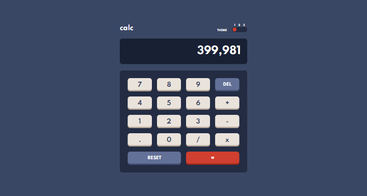
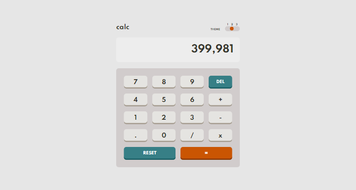
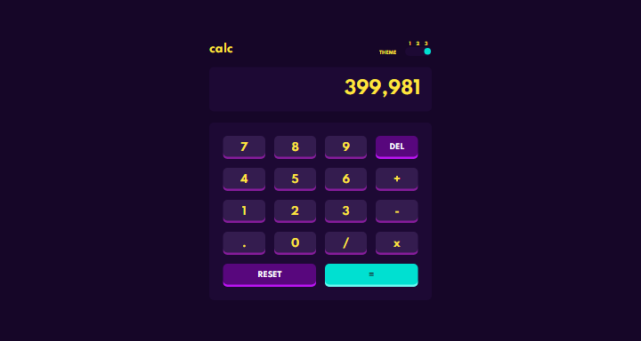
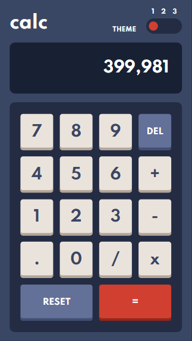
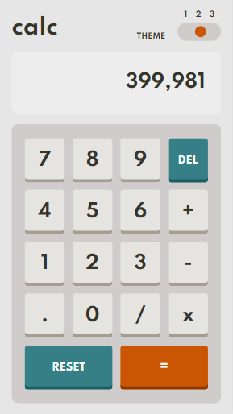
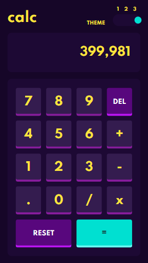

# Frontend Mentor - Calculator app solution

This is a solution to the [Calculator app challenge on Frontend Mentor](https://www.frontendmentor.io/challenges/calculator-app-9lteq5N29). Frontend Mentor challenges help you improve your coding skills by building realistic projects.

> _"No displeasure, no discouragement; if you just failed, start over."_ _Marco Aurelio_

## Table of contents

- [Overview](#overview)
  - [The challenge](#the-challenge)
  - [Screenshot](#screenshot)
  - [Links](#links)
- [My process](#my-process)
  - [Built with](#built-with)
  - [What I learned](#what-i-learned)
- [Author](#author)

## Overview

### The challenge

Users should be able to:

- See the size of the elements adjust based on their device's screen size
- Perform mathmatical operations like addition, subtraction, multiplication, and division
- Adjust the color theme based on their preference
- **Bonus**: Have their initial theme preference checked using `prefers-color-scheme` and have any additional changes saved in the browser

### Screenshot

#### Desktop - 1440px

- theme 1



- theme 2



- theme 3



#### Mobile - 375px

- theme 1



- theme 2



- theme 3



### Links

- Solution URL: [Add solution URL here](https://your-solution-url.com)
- Live Site URL: [Calculator](https://LuanFlorencioo.github.io/Calculator)

## My process

### Built with

- Semantic HTML5 markup
- SASS / SCSS for styling
- Flexbox layout
- Grid layout
- Media Queries
- Mobile-first workflow
- Javascript

### What I learned

I learned to use sass in projects, and it really helped a lot in styling, but also in organizing the color variables of the themes. The choice of this tool was my decision to improve and evolve in web development.

I can also say that this was a project in which I applied some clean code methods, while acquiring such knowledge through the book, reconciling both things.

In this project, as a bonus challenge, there was an objective to apply the calculator theme against the user's system theme with the use of prefers-color-scheme. I confess that I didn't know how to apply such a feature, which made me look for and understand how to enjoy it on the internet. However, I learned, and this is the end result:

```scss
@media (prefers-color-scheme: dark) {
    :root {
        /* variables for dark theme*/
    }
}
```

For the theme switching logic I coded the simple code:

```javascript
const changeNextTheme = () => {
    const idCurrentTheme = body.dataset.theme;
    if (idCurrentTheme == '3')
        body.dataset.theme = '1';
    else
        body.dataset.theme = +(body.dataset.theme) + 1;
}
```

## Author


_Luan Florêncio_

- GitHub - [LuanFlorencioo](https://github.com/LuanFlorencioo)
- Frontend Mentor - [@LuanFlorencioo](https://www.frontendmentor.io/profile/LuanFlorencioo)
- Twitter - [@LuanF_dev](https://www.twitter.com/LuanF_dev)